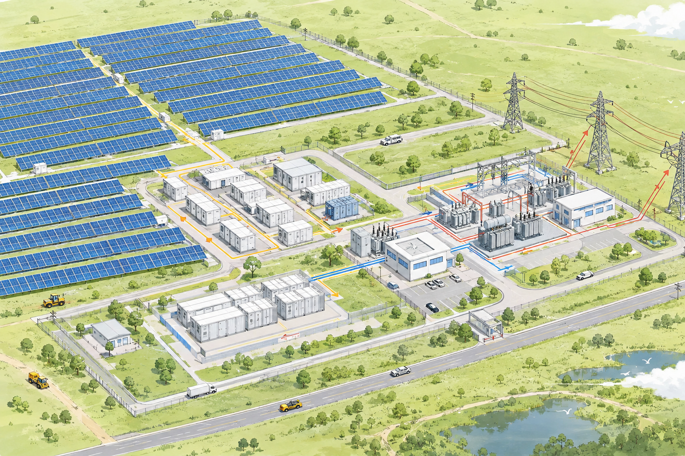

# sasaki-pv-station-demo

基于 Vite + Vue 3 + TypeScript + Three.js 的 PV（光伏）电站可视化演示项目。

## 项目简介

本项目用于演示光伏电站的三维场景可视化，借助 Three.js 渲染电站模型，配合 Vue 3 组合式 API 进行交互展示。

## 效果预览



## 技术栈

- Vite 6
- Vue 3.5
- TypeScript 5.7
- Three.js 0.170

## 快速开始

```bash
# 安装依赖
npm install

# 启动开发服务器
npm run dev

# 类型检查
npm run typecheck

# 构建生产版本
npm run build

# 预览构建产物
npm run preview
```

## 目录结构

```
.
├── assets/         # 静态资源（图片等）
├── src/            # 源码目录
│   ├── components/ # Vue 组件
│   ├── data/       # 数据文件
│   ├── three/      # Three.js 场景相关逻辑
│   ├── App.vue     # 根组件
│   ├── main.ts     # 入口文件
│   └── style.css   # 全局样式
├── index.html      # HTML 入口
├── vite.config.ts  # Vite 配置
└── tsconfig.json   # TypeScript 配置
```
